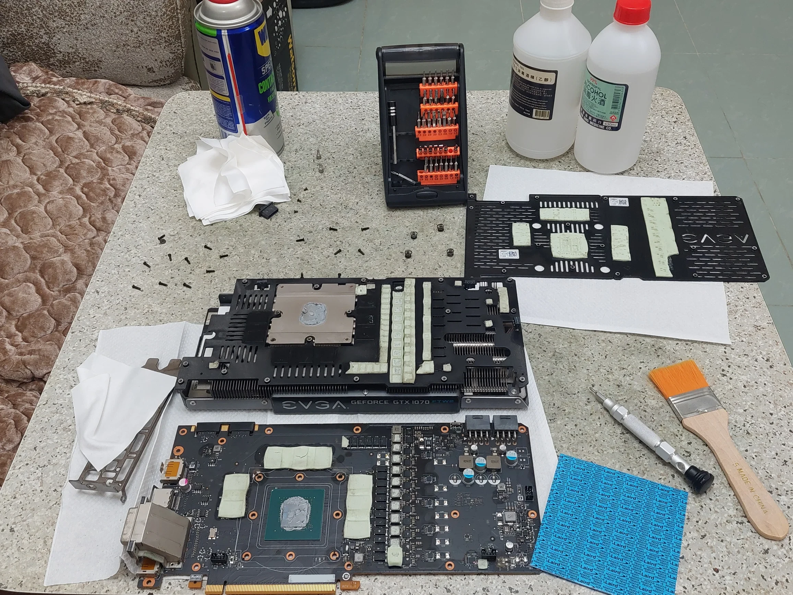
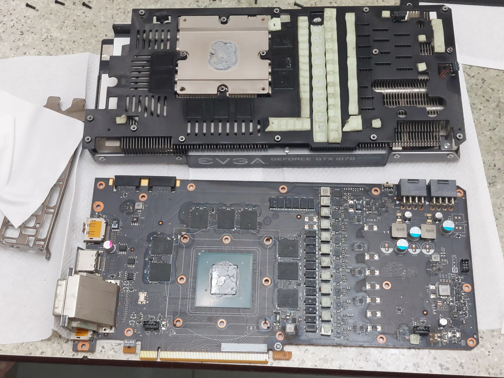
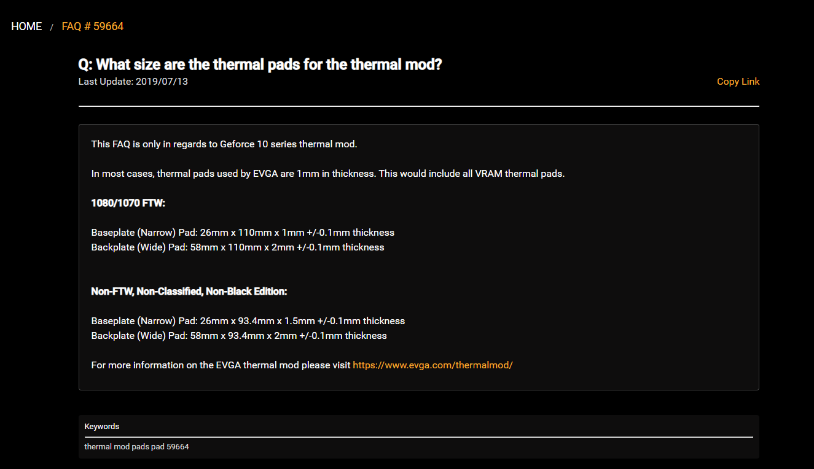
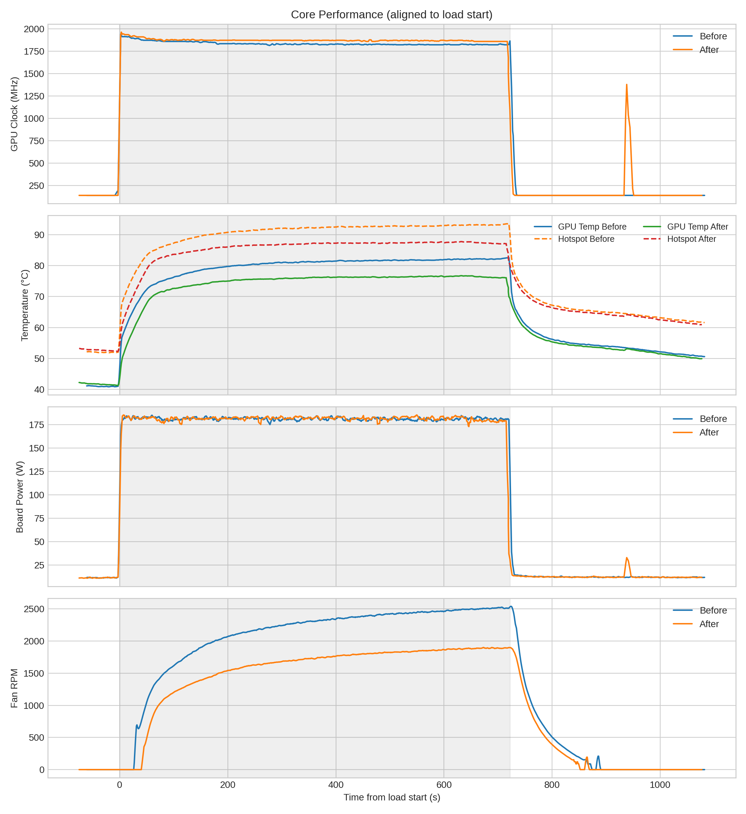
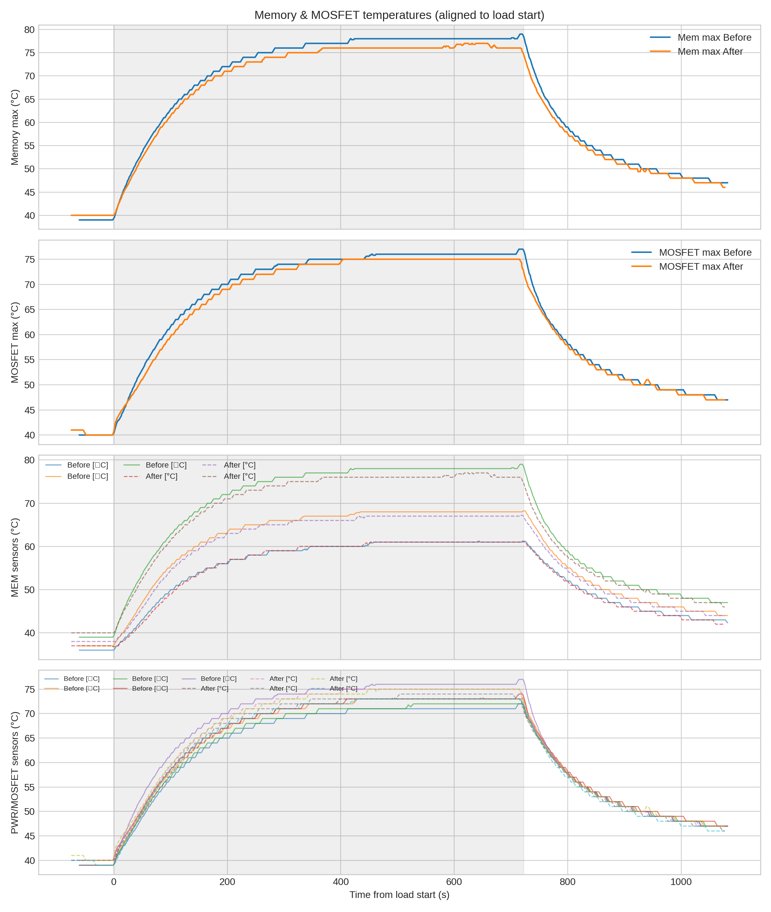

> TLDR: On the GTX1070, replacing thermal pad does not yield any extra performance nor temperature difference. However, replacing the core thermal interface to Honeywell PTM7950 does make significant improvement, from 82°C (thermal throttled) to 76C (full power) while reducing fan speed from 2500RPM to 1800RPM.

# Background
I have been using this EVGA GTX1070 FTW2 since 2017, I have only disassembled it once back in 2023 Aug for repasting.
Though, the core overheating issue (keeps hitting the 82°C threshold) remains, due to dried thermal paste and dust after years of heavy use.
Thus, in 2025 Dec, I have decided to do a complete cleanup of the GPU, as the current GPU market price is high, this 1070 could be used for few more years until the RTX60 series is out. 

The purpose of this disassembling and cleaning was to clean the heatsink and fans, as well as changing the thermal media between the heat source and the heat sink.

:::caution[Disclaimer]
This could break or damage your GPU if done improperly and 100% void your warranty. If theres thermal issue, try cleaning dust without disassembling the whole card.
:::

# Tools used
- Screwdriver set (Phillips)
- Cleaning solvent (99% alcohol + WD-40 CONTACT CLEANER)
- Brush
- New thermal paste for replacement
- New thermal pad for replacement (Optional)
- Lots of single use wipes
- Cutter

Freshly opened card with tools

# Product selection

## Thermal Paste
Honeywell PTM7950 is chosen here because of its exceptional performance and longevity under high stress usage. 7950 in pad package has been used. 

In the 2023 Aug paste change, I have used the shin etsu 7921, though, the performance is poor, either due to bad application thickness or bootleg paste.

For the GTX1070, `20*30*0.2mm` is enough to cover the whole GP104 die.
Please check online for your GPU die dimension before buying the 7950 pads and there are rumors on fake 7950 that does not perform as expected, please buy from reputable source.

## Thermal Pad

Laird T-flex 600 is chosen here because of its hardness similar to original EVGA thermal pad yet having better thermal conductivity.
From visual inspection, seems the original OEM uses Laird T-flex 300 green thermal pad, it sucks, it leaks oil stain on the PCB, everything in contact with the pad has oil films. 

- 2x `1mm thick 90*90mm` T-flex 600
- 1x `2mm thick 45*90mm` T-flex 600

Oily Card

> You can see the thermal paste pump out effect on the die itself, causing poor hot spot temp

For the thermal pad selection guide, I have referenced this comparison video of different Laird pads. Please do check it out, it is really detailed. 

<iframe width="100%" height="468" src="//player.bilibili.com/player.html?bvid=BV1hv41187dk&autoplay=0" scrolling="no" border="0" frameborder="no" framespacing="0" allowfullscreen="true"> </iframe>

*Fun fact, it is insufficient to replace all thermal pads on the GTX1070 with the above pads, but all those important contacts with MOSFET and VRAM pads were replaced. It is just not economically viable to spend 200+ HKD for a 500HKD 2nd hand GPU in late 2025.*

These 2 sources show the disassemble of the card, their thermal pad layout is similar to the GTX1070. I have used this as reference.
- [Video of EVGA 1080 Ti FTW3 Tear-Down & Preliminary PCB Specs by Gamers Nexus](https://www.youtube.com/watch?v=uBjTi0uj64E)
- [Reddit Post of EVGA GTX 1070ti FTW2 ICX Thermal Pads replacement](https://www.reddit.com/r/nvidia/comments/lpa7ex/evga_gtx_1070ti_ftw2_icx_thermal_pads_replacement/)

## Thermal pad thickness
Based on this official [EVGA FAQ](https://www.evga.com/support/faq/FAQdetails.aspx?faqid=59664) and my own disassemble

EVGA Forum FAQ for 10 Series Thermal Pad Thickness

:::important[Thickness]
For all the components between the heat sink and the chip/memory (Frontside), all 1mm.

For all the components between backside of PCB to backplate (Backside), all 2mm.
:::

# Procedure

1. Take base temperature stress test benchmark using Furmark before replacing paste/pads
2. Disassemble
3. Clean with brush
4. Wash with solvent (Seems oil stains cant be washed)
5. Let it dry completely 
6. Apply new correct thickness thermal pad, make sure new pads are not too hard and not too thick, as it will worsen the contact of the core (Optional, you can reuse if it has not break)
7. Apply thermal paste
8. Assemble
9. Benchmark

> Make sure to check temp after disassembling. The core and mem temp should be all consistent and no heat spot or worse performance compare to before disassemble. 

# Result
A before and after Furmark benchmark has been conducted with Data logged from GPU-Z.

- -5°C core/hotspot
- -543 RPM fan
- Same power comsumption

## Test Specification 
| Metric | Specification |
|----------|---------------|
| Ambient Temperature (Before Disassemble) | 23°C |
| Ambient Temperature (After Disassemble) | 22°C |
| Power | 180 W |
| Duration | 720 Seconds |

Core performance + temps + fan + power

---

Memory & MOSFET/VRM thermals

---

## Summary table

| Metric                          | Before (Amb\~23°C)                        | After (Amb\~22°C)                         | Δ              |
| :------------------------------ | :---------------------------------------- | :---------------------------------------- | :------------- |
| Avg GPU clock (MHz)             | 1838.1                                    | 1874.6                                    | +36.5 MHz      |
| Avg board power (W)             | 181.2                                     | 181.3                                     | +0.1 W         |
| Avg GPU temp (°C)               | 79.4                                      | 74.2                                      | -5.1°C         |
| Avg fan RPM                     | 2089                                      | 1546                                      | -543 RPM       |
| Mem peak (°C)                   | 79.0                                      | 77.0                                      | -2.0°C         |
| MOSFET peak (°C)                | 77.0                                      | 75.0                                      | -2.0°C         |

The new thermal paste does help to reach higher clocks and cooler core, lower fan RPM given the same ~180W power. However, it seems the new thermal pad only provides limited improvement on the Memory/MOSFET temperature. Considering the cost of the materials. I would say that it is worth changing to PTM7950. But doesn't worth changing the thermal pads unless it has serious thermal issues.

