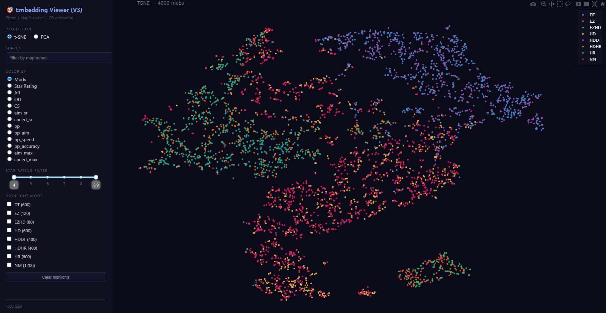
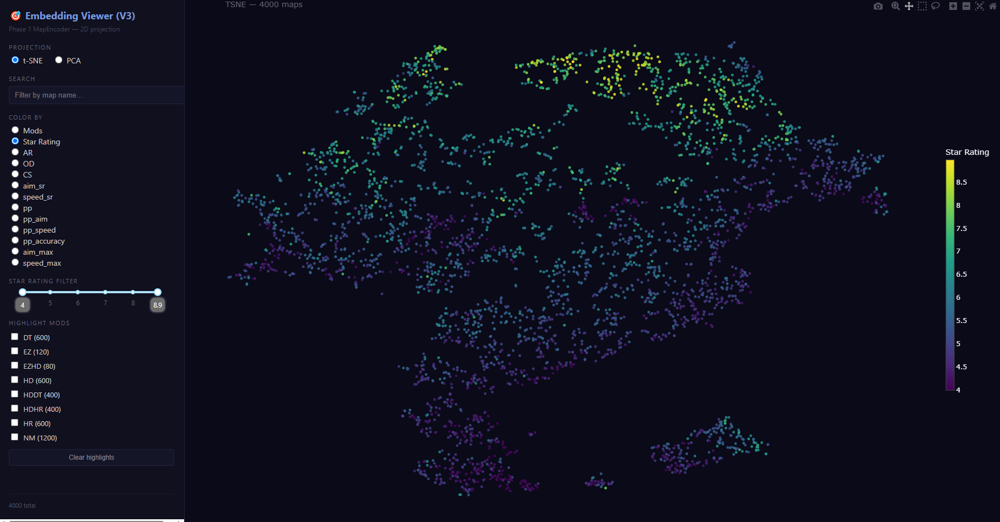
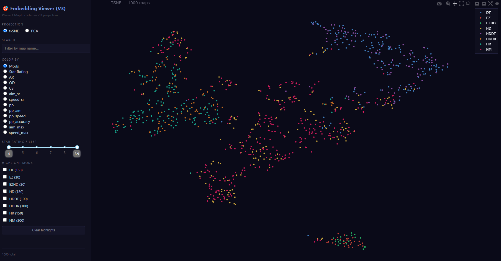
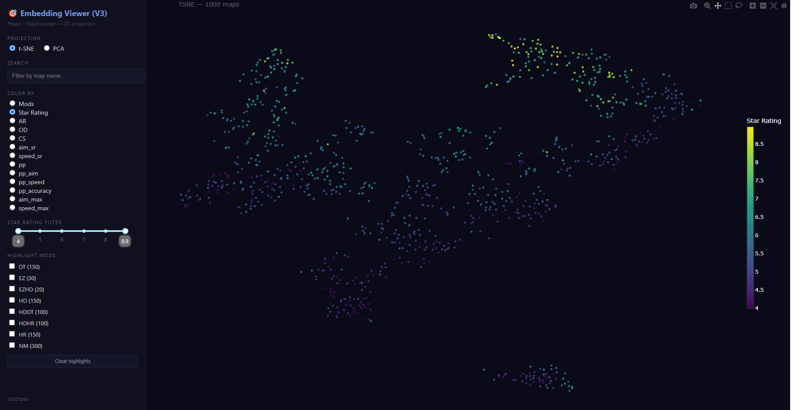

<h1>Abstract</h1>

This project builds a deep learning model to predict player performance in osu! tournaments. It uses a Transformer model to encode beatmap difficulty and a KNN model to estimate expected scores based on similar past tournament maps, assisting the process of evaluating player strengths and support pick ban decisions as a second opinion.

:::warning[Disclaimer]
This project was heavily assisted by AI in development, including opinion on model design, implementation and validation. Me, myself is not an expert in machine learning and this work reflects as a learning notes.

This article aims to propose a general framework for this approach. The exact implementation details and source code are not provided.
:::

---

# 1. Introduction 

## 1.1 Background and Problem Statement 

osu! tournaments are competitive events consisting of multiple players, each with different abilities and skillsets they are good at. In a match, two teams of 2 to 8 players compete against each other on a specific picked map.

A mappool can consist of 9 to 15+ maps, with different skillsets required for each map. For instance, a normal slot pooled mappool may include NM1/2/3/4/5, HD1/2, HR1/2, DT1/2/3, FM1/2 and TB. Each of the slots emphasizes different skills, such as consistency for NM1, streaming for NM2, alternating for NM3, tech for NM4 and our beloved AR8+HD for HD2.

As a team captain, the preparation before each match includes estimating our own team's scores, analyzing strengths and weaknesses of our team, analyzing the opponent team's past scores and predicting the opponent's strengths and weaknesses. Finally, the captain forms a priority list of picks and bans that benefit our team the most without losing points to opponent.

However, analyzing opponents and guessing what they are good at are both time consuming and the results are highly dependent on the captain's ability to analyze scores.

For example, if a team is in RO16, they may only have RO32 and Qualifier scores available for prediction, which the dataset is too small and can lead to inaccuracy. Not to mention, team performance is not always constant, opponents could be hiding their true skills by underperforming in earlier stages to create a decoy for later stage advantages.

Moreover, if the tournament mappool is not slot pooled, this means that NM1 in the Qualifier stage and NM1 in the RO32 stage may have completely different styles and require different skillsets (such as Corsix4 Qualifiers NM1 vs RO32 NM1). In this case, the aforementioned method of predicting scores becomes much less reliable.

## 1.2 Motivation 

This project was partly inspired by projects osu! Beatmap Atlas, where different beatmaps are mapped into a 2D space based on their structure, style and difficulty. The general idea is that maps with similar patterns or skill requirements should be located close to each other in this representation space by using embeddings.

Following this idea, this project attempts to build a model that can represent any osu! beatmap mathematically. Instead of only relying on traditional slot labels such as NM1, HD2, or DT3, the model aims to understand the actual characteristics of the map itself, such as aim difficulty, rhythm complexity, reading difficulty, speed, stamina requirement and mods.

## 1.3 Project goals

In this project, a deep learning model will be developed to identify each player's strengths and weaknesses on that specific map. This methodology have been tested and validated for its performance and limitations.

The goal of this project is to create a model that trains from a player's past ScoreV2 scores obtained from various sources, such as past tournament multiplayer room set scores recorded by Elitebotix, or the latest osu! ranked lobby records. Both sources can provide high quality and high quantity datasets, generally with 200+ scores for player performance modelling.

After the model has been trained to differentiate types of maps, the model then receives an unknown map with mods and predicts the player's ScoreV2 performance based on their previous known score maps performance.

The benefit of using such a model is that it can provide a more comprehensive and accurate analysis of each player's performance on a specific map. The map itself will be modelled to represent its style and difficulty. Compared to traditional manual screening and analysis, the model should accelerate the process and provide a more accurate and fair view of the strengths and weaknesses against opponents.

---

# 2. Transformer-Based Deep Learning Method

The objective of this model is to predict a player's ScoreV2 score on any beatmap under any mod combination, given the following inputs:

- The player's previous scores on other maps
- The beatmap `.osu` file of the target map
- The activated mods

The model has to understand the complex and nonlinear difficulty of beatmaps, as well as how players perform against specific types of patterns, speeds, rhythms and mods.

To achieve this, the system is divided into two main stages. The first stage focuses on learning a mathematical representation of maps, while the second stage uses each player's past scores to predict their performance on unseen maps.

## 2.1 Processing Pipeline

A two-stage processing pipeline is used in this project.

Phase 1 uses a Transformer neural network to compress each beatmap into an embedding by training the model to predict 13 skill related values. These embeddings are intended to represent the structure, style and difficulty of each map.

Phase 2 uses a K-Nearest Neighbors algorithm to predict a player's score on a new map by finding the most mathematically similar maps that the player has played in the past.

The idea is that if two maps are structurally similar, a player should perform similarly on both maps. Therefore, by comparing map embeddings, the model can estimate a player's expected performance on an unseen map.

## 2.2 Data Collection and Preprocessing

Given an input `.osu` file and the selected active mods, two preprocessing steps were implemented.

1. A parser reads the raw `.osu` file and extracts important information, such as hit objects and timing points
2. A mod applicator applies mods such as DT, HR and EZ to the extracted data, reflecting changes in AR, CS, OD, coordinates and object timings

### Feature Extraction

After preprocessing, different features have been extracted from the map and used as input for the deep learning model. These features include object features, global map features and a context vector.

1. **Object Features**

Object features describe each individual hit object in the map. These include information such as absolute position, distance from the previous object, angle, timing gap and snapping.

These features allow the model to capture pattern and style of the map, such as jumps, streams, spacing, rhythm changes and wide angle jumps.

2. **Global Features**

Global features describe the overall structure of the map. These include drain time, jump statistics, stream density and strain percentiles.

These features provide broader context about the map difficulty and structure. Two maps may have similar object patterns, but one may be much longer or have more consistent strain, which can affect stamina and consistency.

3. **Context Vector**

The context vector contains post mod map statistics such as CS, AR, OD, BPM and derived difficulty related values. It also includes mod specific implications, such as the effect of HD on lower AR maps as a flag.

This is especially important for tournament maps such as HD2, where the difficulty can change significantly depending on the original AR and the effect of Hidden. In these cases, the map before and after applying mods may feel very different and the model needs to capture that difference.

---

## 2.3 Phase 1 - Self Supervised Learning

Phase 1 is the foundation of the model. This is the deep learning training stage, where a neural network trains on thousands of beatmaps and compresses their patterns, timing and statistics into a 256 dimensional vector, also known as an embedding.

The objective of this stage is to create a universal mathematical representation of any beatmap, so that maps can be compared based on similarity in later phases.

The model attempts to predict 13 specific skill values for each map, such as jump aim, stamina, reading and tech. These 13 skills are calculated using mathematical formulas and are used to describe the characteristics of each map.

By learning to predict these 13 skills, the model's internal 256 dimensional embedding learns to organize maps based on their structure and difficulty. Maps that require similar skills should be placed closer together in the embedding space.

This allows the encoder to learn difficulty, rhythm and pattern structure without requiring manual score labels.

### Process Flow

The model uses a 6 layer, 8 head attention focused Transformer encoder that processes the sequence of hit objects.

The actual implementation is as follows:

1. Load the `.osu` file and extract the three categories of features
2. Generate the 13 target skill labels
3. Pass the extracted features through the encoder to obtain a 256 dimensional embedding
4. Pass the embedding through a prediction head to predict the 13 skill values
5. Calculate the loss and update the model weights
6. Save the best performing model weights

With this Phase 1 model, any `.osu` file can be converted into an embedding that represents its difficulty, style and map specific skills. These embeddings can then be used to group similar maps together.

## 2.4 Phase 2 - Player Profiling and Validation (KNN + LOO)

Phase 2 uses the trained Phase 1 encoder to build a player specific profile.

The Phase 1 encoder should already understand how different maps are structurally different from each other and what skillsets they require. Therefore, maps with similar skill requirements should be grouped close to each other in the embedding space.

For each player, all maps that they have played with known scores are processed through the Phase 1 encoder. Each map is converted into a 256 dimensional embedding. These embeddings with the player's actual scores are then used to fit a K-Nearest Neighbors model for that player.

A Leave-One-Out cross validation process is used to find the optimal number of neighbors -K- for each player.

Instead of training a large neural network for every individual player, this phase uses distance weighted averaging in the embedding space. When predicting a player's score on a new map, the model finds the K most structurally similar maps that the player has played before. It then averages the player's scores on those maps, with closer maps having higher influence.

Afterwards, an unseen map dataset is used for validation. The selected mods are applied to the maps, the Phase 1 model generates embeddings and the Phase 2 KNN profile is queried to generate predicted scores on these validation maps.

This sets baseline for each player based on their strengths and weaknesses. It also validates the accuracy of the pipeline before using it to predict performance on completely new maps.

## 2.5 Phase 3 - Prediction on Unseen Maps

Phase 3 applies the full pipeline to completely new unseen maps.

In this stage, the model uses the frozen Phase 1 map encoder and the optimized Phase 2 player profile. A new beatmap is first processed with the selected mods applied. The processed map is then projected into the same 256 dimensional embedding space.

After that, the player's KNN profile searches for the most similar maps from the player's historical score data. Based on those neighboring maps and their known scores, the model predicts what ScoreV2 score the player is expected to achieve on the new map.

This phase allows the system to estimate player's expected performance on a tournament mappool before the match is being played. The predicted scores can then be used to support pick and ban decisions, identify favorable maps and highlight potential weaknesses.

---

# 3. Results and Validation
## 3.1 Overall Performance Metrics

For our model evaluation, a LOO validation has been run using the embedding K nearest neighbors approach. This measures how well the model performs when predicting target values based on learned embeddings. 

The validation was performed on 148 of my personal tournament scores. The performance metrics of the model are as follows:

| Metric | Value |
|---|---:|
| **Test Samples** | 148 |
| **MAE** | 160,839 |
| **RMSE** | 202,397 |
| **Median AE** | 145,288 |
| **R²** | 0.5125 |
| **Pearson r** | 0.7329 |
| **Within ±5%** | 12.84% |
| **Within ±10%** | 18.24% |

The result does not look too accurate, with R² at 0.51 only and MAE of 160k. Even though it has a quite high MAE of 160k, this can still represent how the player performs generally.

### Per Mod Insights

| Mod | N | MAE | RMSE | Mean Predicted | Mean Actual |
|:---:|:---:|---:|---:|---:|---:|
| **NM** | 54 | 141,251 | 180,835 | 448,531 | 409,230 |
| **DT** | 40 | 231,735 | 274,520 | 748,172 | 712,873 |
| **HD** | 37 | 130,926 | 157,699 | 405,543 | 373,870 |
| **HR** | 16 | 115,196 | 140,085 | 295,735 | 213,049 |
| **EZ** | 1 | 219,768 | 219,768 | 354,143 | 134,375 |

Note that for NM, DT and HR, the model predicts with acceptable accuracy. However, for DT, the MAE is significantly higher despite having a larger dataset. This may be due to the DT dataset generally has a higher mean score, ScoreV2 relies heavily on combo to achieve scores close to 1M. As a result, even a single miss or choke, despite high confidence and performance, can lead to a significantly lower score.

The model generally predicts high scores. However, even though a player is capable of achieving a high score, they may fail to do so on specific maps. This leads to a mismatch between the predicted and actual scores.

This trend of higher MAE for scores approaching 1M is expected. Therefore, the error data should be interpreted as percentage error difference. This will be implemented in the next revision.

## 3.2 Embeddings Visualization

Below is the visualization of the embeddings projected in 2D space with t-SNE after passing through phase 1 encoder:

Fig. 1. Visualization by mods for training dataset.

Fig. 2. Visualization by star rating for training dataset.

---

Fig. 3. Visualization by mods for validation dataset.

Fig. 4. Visualization by star rating for validation dataset.

### Insights

From the results, the trends for different mods form distinct islands is observed, showing a clear separation between DT and NM/HR due to their differences in BPM or CS/OD. This behavior carries over to the validation set as well, meaning that the model weights are correctly trained without overfitting.

For the star rating, we can see a good separation behavior on top of the existing mod discrimination, there is also a difficulty separation within each mod. Visible in Figure 2 and Figure 4.

:::warning[Area for Improvement]
The HD mod flag was not treated correctly as seen in Figure 1 and Figure 3. The HD mod and HDDT/HDHR mods do not have a separate island to differentiate skills. This might cause noise when predicting HD map behavior, as a player who can play NM could perform worse with HD. It seems that the problem is not model underfitting, rather a fundamental rework of the objective and the flags mechanism needs to be revised.
:::

## 3.3 Optimization methods used

Since I am training the model on an NVIDIA GTX1070, which does not have the Tensor core to boost FP16/FP8 or the newer TF32. However, when testing on school lab with RTX4090, the AMP shows significant improvement on the training speed. It was at least 20x faster than my own PC.

Gradient Checkpointing is also implemented to allow larger batch size on limited VRAM.

Multiprocessing and disk caching is also implemented when parsing the .osu files, so the same embedding processing won't be done repeatedly.

First time feeling that a powerful PC is necessary for this kind of work and how well optimization can save both time and VRAM.

---

# 4. Conclusion

This model suggests a way to ease time and effort needed for selecting the most optimal picks and bans for an osu! tournament match. With an average MAE of 160k, the model can grade player ability on a given map based on past match history.

However, the current % error is still high, meaning that the model is not robust enough. Since the model (Phase 1) is only trained on a selected dataset of ~12k maps with mods, the deep learning model might not have enough information to discriminate different kinds of maps clearly. Though, the 12k maps are sourced from ranked maps of osu!standard, filtered by 4–9 stars, with different mod combinations. For context, there are 100k+ maps available for training after data augmentation. The 12k maps, with 3k maps used as validation for losses, were selected because of the limitation of computational power. Training 12k maps already took 24+ hours on my GTX1070.

The current method of using KNN and LOO might not be the most optimal, a better way is to pass the embeddings to a downstream machine learning model, such as XGBoost, which I am currently working on for experimental framework. A follow up blog will discuss this method further, preliminary result shows that this method perform better compared to current method (~0.7 R²).

## 4.1 Potential Future Work

- Combining all team player performance and predicting the team performance on a 4v4 match (Select best 4 out of 8)

- Adding a confidence interval of 95% helps predicting with higher accuracy.

- Adding a date attenuation mechanism helps with filtering older scores. For example, a score of the same map set on 2022 and 2026 could be 100k and 800k, without this attenuation, the model might think they have the same weight, however, player will improve it's skills overtime, therefore the 100k score should have less weight when making decision on predicting.

- During Phase 1 training, an interesting phenomenon was observed. When visualizing the training dataset, there was a clear separation into distinct clusters/islands for different types of maps, indicating that they were perfectly discriminated. However, when switching to the validation set, the model failed to group similar types of maps clearly. The model confused 7* maps with 4* maps, even though they are not similar in any meaningful way. This suggests that future work may need to focus more on distinguishing features such as star rating and approach rate, rather than emphasizing map "style and preferences". Perhaps, this issue might simply due to insufficient training of the model.

- Further extensive research could be pick ban behavior prediction based on historic data (maps skipped)

